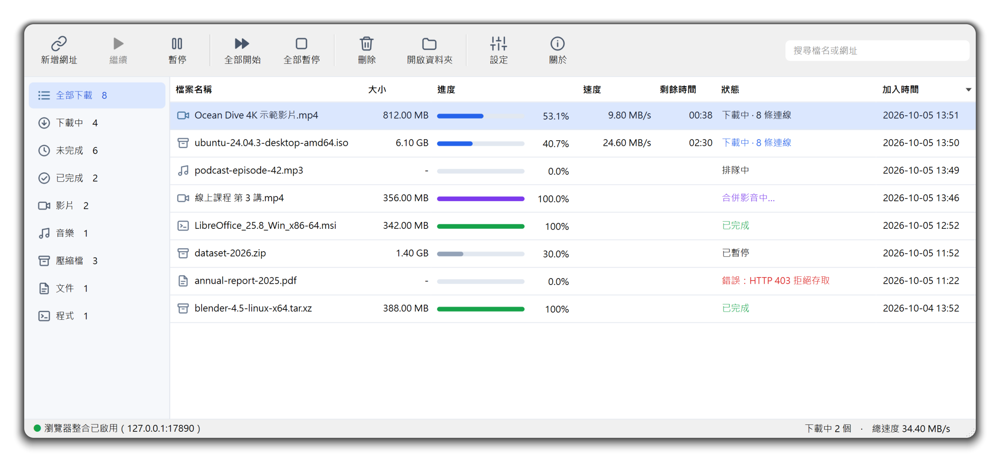
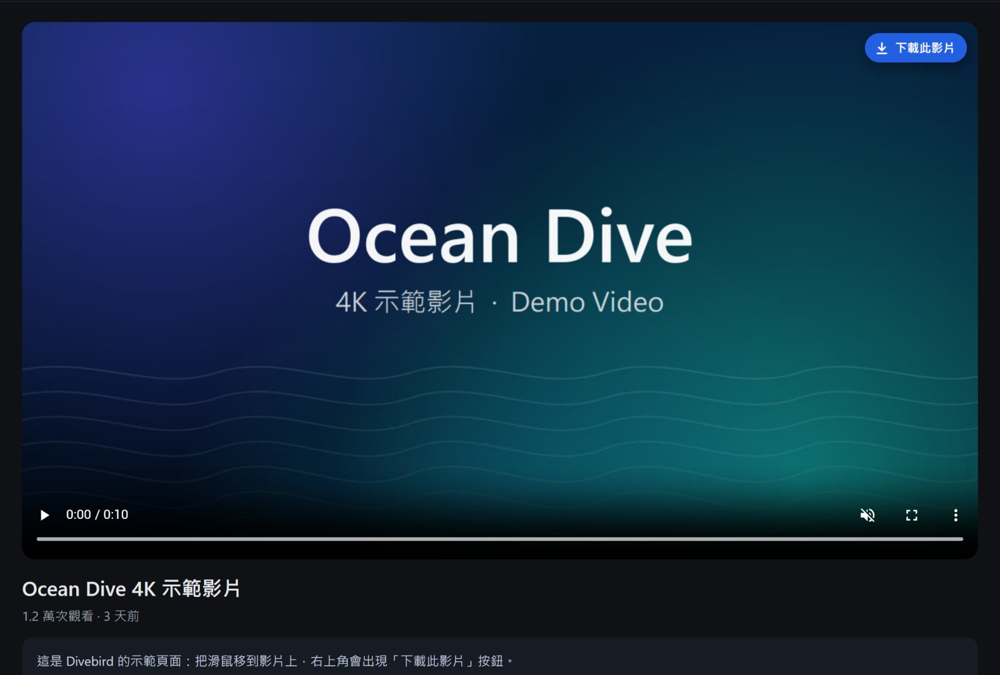
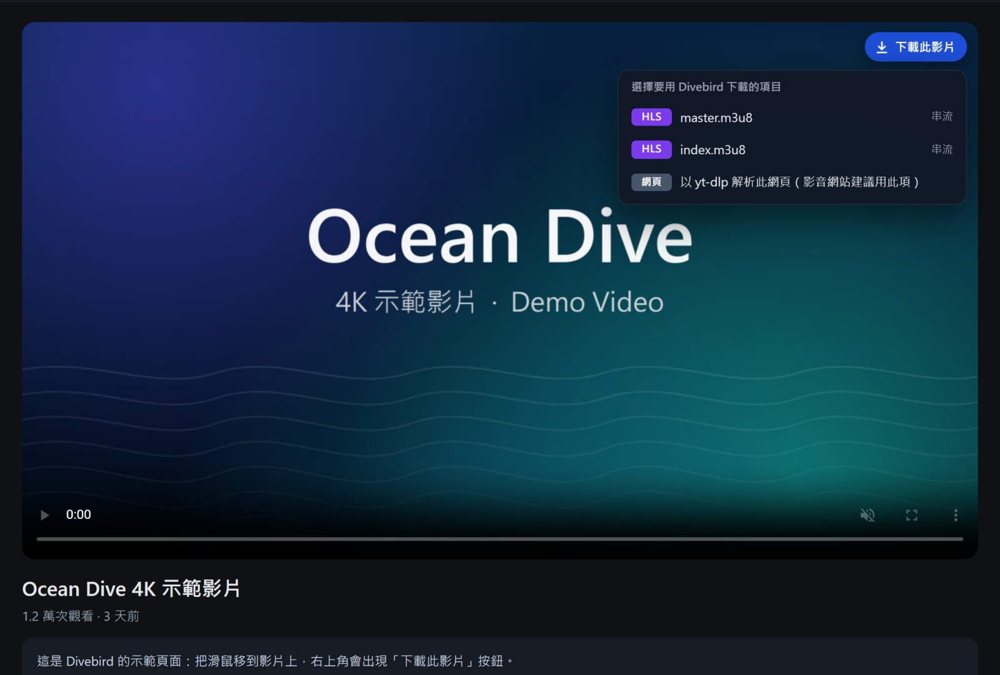
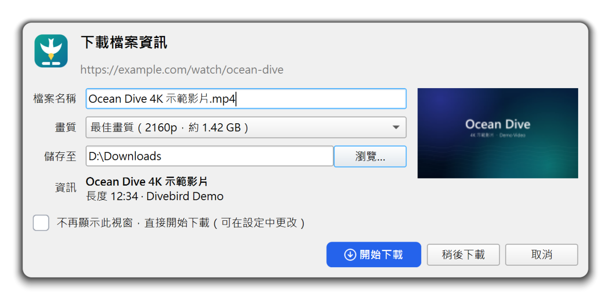
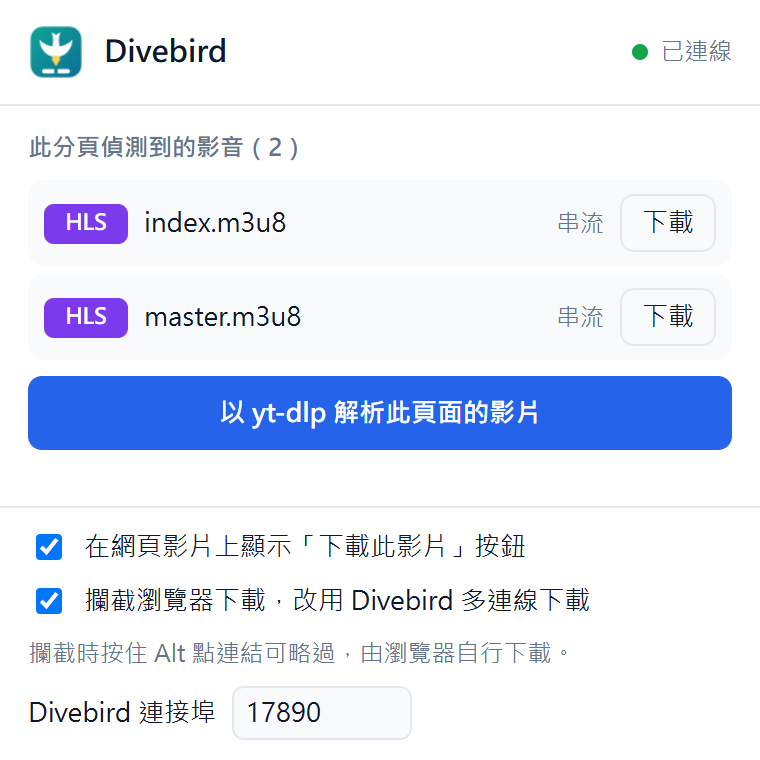
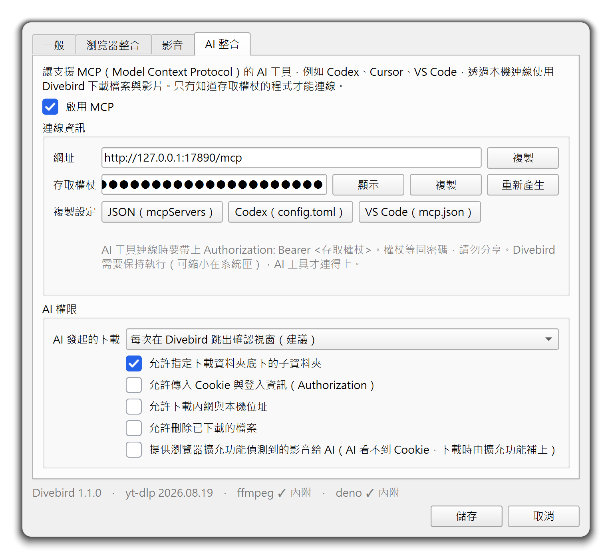
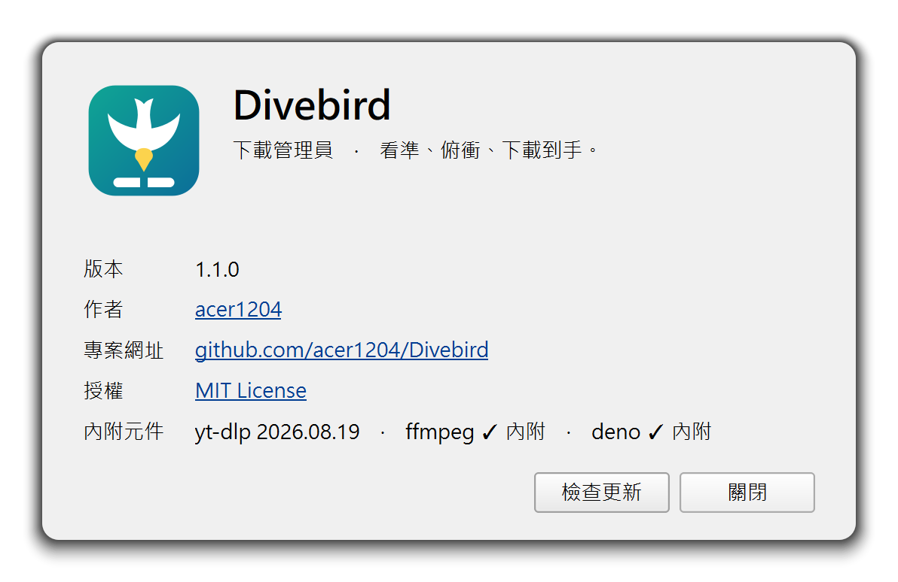
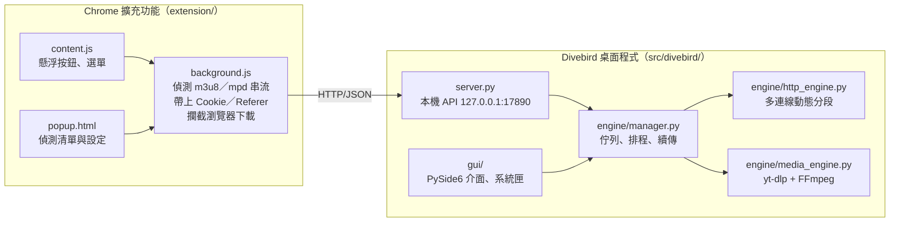
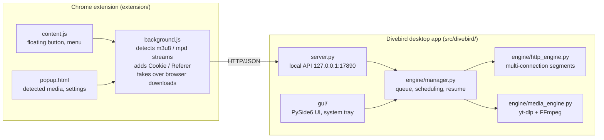

<p align="center">
  
</p>

<h1 align="center">Divebird</h1>

<p align="center">
  <b>看準、俯衝、下載到手。</b><br>
  <i>See it. Dive. Download.</i>
</p>

<p align="center">
  <a href="https://github.com/acer1204/Divebird/releases/latest"></a>
  
  <a href="LICENSE"></a>
  <a href="https://github.com/acer1204/Divebird/actions/workflows/build.yml"></a>
</p>

<p align="center">
  <a href="#繁體中文">繁體中文</a> · <a href="#english">English</a>
</p>

<picture>
  <source media="(prefers-color-scheme: dark)" srcset="docs/images/main-dark.png">
  
</picture>

---

## 繁體中文

Divebird 是開源、跨平台（Windows／Linux）的下載管理員，支援多連線下載與斷點續傳，還能一鍵下載網頁影片。搭配隨附的 Chrome 擴充功能，在網頁上播放影片時，影片右上角會出現「**下載此影片**」按鈕，點一下就交給 Divebird 下載。

> 名字的由來：鰹鳥看準海裡的魚，收起翅膀俯衝，一次就叼走。Divebird 也是這樣——看準網頁上的影片，一鍵下載。

### 功能特色

| 功能 | 說明 |
| --- | --- |
| **影片懸浮按鈕** | 自動偵測網頁中的影片，包含被播放器遮罩蓋住的、iframe 內嵌的、全螢幕播放器中的影片；滑鼠移到影片上就會出現「下載此影片」按鈕 |
| **串流偵測** | 監聽網路請求，抓出 HLS（`.m3u8`）、DASH（`.mpd`）串流與影音檔；偵測到多個來源時會跳出選單讓你挑選，串流下載完成後自動合併成 MP4（可在設定改為 MKV） |
| **影音網站** | 內建 [yt-dlp](https://github.com/yt-dlp/yt-dlp)，支援上千個影音網站；下載前可選畫質，或只下載音訊（M4A／MP3） |
| **多連線下載** | 將檔案切成多段，同時以多條連線下載（預設 8 條）；先完成的連線會把剩餘最多的分段從中間切開、接手後半段，讓每條連線都保持忙碌 |
| **斷點續傳** | 暫停、斷線或關閉程式後，都能從中斷處繼續（伺服器需支援續傳） |
| **攔截瀏覽器下載** | 一般檔案的下載會自動轉交 Divebird 多連線下載；按住 **Alt** 再點連結，則改由瀏覽器自行下載 |
| **內建執行環境** | 免安裝版已內含 Python、Qt、yt-dlp、FFmpeg、Deno，不需要另外安裝任何軟體 |
| **AI 整合（MCP）** | 支援 MCP 的 AI 工具可以請 Divebird 下載、查詢進度；權限可在設定中控制，AI 發起的下載預設要經你確認 |
| **其他** | 下載佇列、同時下載數與全域限速、分類與搜尋、拖曳網址、系統匣、完成通知、登入時自動啟動、深色模式、檢查更新 |

### 截圖

<table>
  <tr>
    <td width="50%"></td>
    <td width="50%"></td>
  </tr>
  <tr>
    <td align="center">滑鼠移到影片上，右上角會出現「下載此影片」按鈕</td>
    <td align="center">偵測到多個串流時，選擇要下載哪一個</td>
  </tr>
  <tr>
    <td width="50%">
      <picture>
        <source media="(prefers-color-scheme: dark)" srcset="docs/images/dialog-dark.png">
        
      </picture>
    </td>
    <td width="50%" align="center"></td>
  </tr>
  <tr>
    <td align="center">下載前確認檔名、畫質與儲存位置</td>
    <td align="center">擴充功能彈出視窗：偵測到的影音與設定</td>
  </tr>
  <tr>
    <td width="50%">
      <picture>
        <source media="(prefers-color-scheme: dark)" srcset="docs/images/settings-ai-dark.png">
        
      </picture>
    </td>
    <td width="50%">
      <picture>
        <source media="(prefers-color-scheme: dark)" srcset="docs/images/about-dark.png">
        
      </picture>
    </td>
  </tr>
  <tr>
    <td align="center">設定 → AI 整合：啟用 MCP、複製連線設定、決定 AI 的權限</td>
    <td align="center">關於：版本、作者與授權，按「檢查更新」查看 GitHub 上有沒有新版</td>
  </tr>
</table>

### 安裝與執行

#### 方式一：下載免安裝版（推薦）

到 [Releases](https://github.com/acer1204/Divebird/releases/latest) 下載對應的檔案：

| 系統 | 檔案 | 執行方式 |
| --- | --- | --- |
| Windows 10／11（64 位元） | `Divebird-<版本>-windows-x64.zip` | 解壓縮後，按兩下 `Divebird\Divebird.exe` |
| Linux x86_64 | `Divebird-<版本>-linux-x86_64.tar.gz` | 解壓縮後執行 `./Divebird/install.sh` |

- **Windows**：程式沒有數位簽章，第一次執行若出現「Windows 已保護您的電腦」，請按「其他資訊」→「仍要執行」。
- **Linux**：
  - 需要 glibc 2.35 以上的發行版，例如 Ubuntu 22.04 以上、Debian 12 以上、Fedora 36 以上。
  - `install.sh` 會將程式安裝到 `~/.local/share/divebird`，在應用程式選單建立捷徑、建立 `divebird` 指令，並設定登入時自動啟動（若不需要自動啟動，請改為執行 `./Divebird/install.sh --no-autostart`）。
  - 解除安裝：刪除 `~/.local/share/divebird`、`~/.local/share/applications/divebird.desktop`、`~/.config/autostart/divebird.desktop` 與 `~/.local/bin/divebird`。
  - GNOME 預設沒有系統匣，可安裝 GNOME 擴充套件「AppIndicator and KStatusNotifierItem Support」；沒有系統匣時，關閉視窗會改為最小化到工作列（按 **Ctrl+Q** 結束程式）。
- 每個版本都附有 `SHA256SUMS.txt`，可用來驗證下載的檔案是否完整。

#### 方式二：從原始碼執行

```bash
git clone https://github.com/acer1204/Divebird.git
cd Divebird
```

| 系統 | 啟動 | 建立有圖示的捷徑（選用） |
| --- | --- | --- |
| Windows | 第一次按兩下 `Divebird.bat`；之後按兩下 `Divebird.exe` | `powershell -ExecutionPolicy Bypass -File scripts\create-shortcut.ps1` |
| Linux | `./divebird.sh` | `./scripts/create-shortcut.sh` |

第一次啟動時，程式會自動在專案資料夾內建立執行環境（需要幾分鐘）：將 [uv](https://github.com/astral-sh/uv)、獨立的 Python 3.12 與所有套件下載到 `.runtime/` 與 `.venv/`，**不會使用或修改系統上的 Python**。之後啟動只要幾秒。

- Windows：建立環境時，也會用 Windows 內建的 .NET Framework 編譯器在專案根目錄產生 `Divebird.exe` 啟動程式。用它啟動不會出現主控台視窗（`.bat` 檔一定會先閃一下黑色視窗）；若系統封鎖編譯器而沒有產生，仍可用 `Divebird.bat` 啟動（不想產生可設定環境變數 `DIVEBIRD_NO_LAUNCHER=1`）。
- 用 `git pull` 更新後，若相依套件或啟動程式有變動，下次用 `Divebird.exe`、`Divebird.bat`、捷徑或登入自動啟動開啟時，會先自動更新執行環境（會開一個視窗顯示進度）；上次建立環境中斷時也一樣會自動補完。Divebird 正在執行（包括縮小在系統匣）時不會更新，請先結束再開啟。
- 搬移、改名或複製專案資料夾後，執行環境需要重建：按兩下 `Divebird.exe` 會詢問是否重建（`Divebird.bat` 也會自動偵測），也可以在專案資料夾開啟終端機，執行 `.\Divebird.bat /repair`。重建前請先結束正在執行的 Divebird；重建失敗時會保留原本的環境。
- Linux 使用 X11 桌面時，需另外安裝系統套件 `libxcb-cursor0`（Ubuntu／Debian：`sudo apt install libxcb-cursor0`；Fedora：`sudo dnf install xcb-util-cursor`；Arch：`sudo pacman -S xcb-util-cursor`）。免安裝版已內含，不需要安裝。
- 刪除專案資料夾即可移除執行環境；設定與下載清單存放在 `%APPDATA%\Divebird\`／`~/.config/divebird/`，建立過的捷徑與登入自動啟動需另外移除。

### 安裝 Chrome 擴充功能

擴充功能已隨附在免安裝版與原始碼中（未上架 Chrome 線上應用程式商店），請依下列步驟手動載入：

1. 在網址列輸入 `chrome://extensions` 並按 Enter（Microsoft Edge 為 `edge://extensions`）。
2. 打開「**開發人員模式**」（Chrome 在右上角，Edge 在左側欄）。
3. 按「**載入未封裝項目**」，選擇 `extension` 資料夾：
   - 免安裝版：`Divebird/extension`
   - Linux 執行 `install.sh` 後：`~/.local/share/divebird/extension`
   - 從原始碼執行：專案根目錄的 `extension`
4. 建議點工具列上的拼圖圖示（擴充功能），將 Divebird 固定到工具列。

使用擴充功能時，Divebird 桌面程式必須保持執行；點工具列上的 Divebird 圖示開啟彈出視窗，右上角顯示「已連線」即表示正常。圖示上的數字是目前分頁偵測到的影音數量。

### 使用方式

- **懸浮按鈕**：把滑鼠移到影片上，按右上角的「下載此影片」。
  - 只偵測到一個影片檔或串流：直接交給 Divebird 下載。
  - 偵測到多個來源：跳出選單讓你選（HLS／DASH／MP4，或以 yt-dlp 解析整個網頁）。
  - 沒偵測到影片檔或串流（例如 YouTube）：整個網頁交給 yt-dlp 解析，再於 Divebird 視窗中選擇畫質。
- **右鍵選單**：在連結或影片／音訊上按右鍵，選擇「用 Divebird 下載此連結」或「用 Divebird 下載此影片／音訊」；在網頁空白處按右鍵，選擇「用 Divebird 解析此頁面的影片」。
- **攔截瀏覽器下載**：一般檔案的下載會自動轉交 Divebird；按住 **Alt** 再點連結，則由瀏覽器自行下載。可在彈出視窗中關閉此功能。
- **桌面程式**：按「新增網址」或直接把連結拖曳到視窗；在清單上按右鍵可開啟檔案、重新下載、複製網址。
- **檢查更新**：按工具列的「關於」，再按「檢查更新」。有新版本時會詢問是否開啟 GitHub 的下載頁面；只有按下按鈕時才會連線查詢。

收到下載時，Divebird 會先顯示「下載檔案資訊」視窗（檔名、大小、畫質、儲存位置）；勾選「不再顯示此視窗」即可改為直接下載，之後可在設定中改回。

### 設定與資料位置

| 項目 | Windows | Linux |
| --- | --- | --- |
| 設定、下載清單 | `%APPDATA%\Divebird\` | `~/.config/divebird/` |
| 預設下載資料夾 | `下載`（`%USERPROFILE%\Downloads`） | XDG 下載資料夾（例如 `~/下載`） |

- **可攜模式**（免安裝版）：在 `Divebird.exe`（Linux 為 `Divebird`）所在的資料夾中，建立一個名為 `portable`、沒有副檔名的空檔案（`portable.txt` 無效），設定與下載清單就會改存放在程式旁的 `data/` 資料夾。
- 桌面程式與擴充功能透過本機的 `127.0.0.1:17890` 連線。若在 Divebird 設定中變更了「本機 API 埠號」，請在擴充功能彈出視窗的「Divebird 連接埠」欄位填入相同的數字。

### AI 整合（MCP）

Divebird 內建 [MCP](https://modelcontextprotocol.io/)（Model Context Protocol）伺服器。支援 MCP 的 AI 工具（例如 Codex、Cursor、VS Code）可以請 Divebird 下載檔案、串流與影片，也能查詢進度、暫停或移除下載。

1. 在 Divebird 開啟「設定 → AI 整合」，勾選「啟用 MCP」後按「儲存」。
2. 在同一頁按「複製設定」，貼到 AI 工具的設定檔：

   | 格式 | 適用 | 設定檔 |
   | --- | --- | --- |
   | JSON（mcpServers） | Cursor 等多數 AI 工具 | 例如 `~/.cursor/mcp.json` |
   | Codex（config.toml） | Codex | `~/.codex/config.toml` |
   | VS Code（mcp.json） | VS Code | 使用者設定或 `.vscode/mcp.json` |

   連線網址是 `http://127.0.0.1:17890/mcp`，以 `Authorization: Bearer <存取權杖>` 驗證。權杖顯示在同一頁，等同密碼，請勿分享。
3. 只能用 stdio 啟動 MCP 伺服器的 AI 應用程式：指令設為免安裝版資料夾裡的 `divebird-mcp`（Windows 為 `divebird-mcp.exe`），不需要參數與權杖；從原始碼執行時，改用 `.venv` 裡的 Python 執行 `-m divebird.mcp`。Divebird 沒在執行時，會自動在背景啟動。
4. 之後就能直接跟 AI 說：「用 Divebird 下載 https://…/master.m3u8，檔名叫第 3 集」。

- **權限**（設定 → AI 整合，啟用 MCP 後才能修改）：AI 發起的下載預設每次都要在 Divebird 跳出的視窗確認，視窗會標示「由 AI 工具發起」；指定子資料夾預設允許；傳入 Cookie 與登入資訊、下載內網位址、刪除檔案預設都不允許。
- **Skill**：[`skills/divebird/SKILL.md`](skills/divebird/SKILL.md) 是給 AI 的使用提示，把這個資料夾的路徑告訴你的 AI 工具即可。
- **瀏覽器偵測到的影音**：在「設定 → AI 整合」勾選「提供瀏覽器擴充功能偵測到的影音給 AI」後，AI 可以列出各分頁偵測到的影音並指定下載，需要登入的網站也能下載：Cookie 由擴充功能在下載時補上，不會經過 AI。AI 只看得到網頁標題與網址的主機、路徑，看不到查詢參數；無痕視窗不分享。需要擴充功能 1.1.0 以上（更新後到 `chrome://extensions` 按重新載入）。沒有開放時，需要登入的網站請改用擴充功能的下載按鈕。
- 支援 MCP 的 2025-03-26 ～ 2025-11-25 與 2026-07-28 兩代協定。Divebird 必須在執行中（可縮小在系統匣），建議開啟登入時自動啟動。

### 自行打包

| 系統 | 指令 | 產出 |
| --- | --- | --- |
| Windows | `powershell -ExecutionPolicy Bypass -File scripts\build.ps1` | `dist\Divebird\`、`dist\Divebird-<版本>-windows-x64.zip` |
| Linux | `./scripts/build.sh` | `dist/Divebird/`、`dist/Divebird-<版本>-linux-<架構>.tar.gz`（例如 `linux-x86_64`） |

- 尚未建立執行環境時，打包腳本會先自動執行 `scripts/setup.*`。
- Linux 打包會一併包進建置機器上的系統函式庫，打包出的程式只能在 glibc 版本不低於建置機器的發行版上執行；若要支援更多發行版，請在較舊的系統上建置。
- 推送 `v` 開頭的標籤（例如 `v1.0.1`）時，GitHub Actions 會在 Windows 與 Ubuntu 22.04 上建置、測試，並自動發佈到 Releases。

### 開發與測試

```bash
./scripts/test.sh                                           # Linux 單元／整合測試
powershell -ExecutionPolicy Bypass -File scripts\test.ps1   # Windows 單元／整合測試
```

- 擴充功能端對端測試（以 Playwright 啟動載入擴充功能的 Chromium，實際點擊懸浮按鈕），使用由 `scripts/setup.*` 安裝在專案內的 uv（Windows 為 `.runtime\uv\uv.exe`）：

  ```bash
  .runtime/uv/uv run --no-project --with playwright python -m playwright install chromium   # 第一次
  .runtime/uv/uv run --no-project --with playwright python tests/e2e/run_extension_e2e.py
  ```

- 打包版煙霧測試：`.venv/bin/python tests/smoke_package.py dist/Divebird/Divebird`（Windows：`.venv\Scripts\python.exe tests\smoke_package.py dist\Divebird\Divebird.exe`）

### 架構

擴充功能負責在瀏覽器中偵測影片與串流，再透過本機 API 交給桌面程式下載：



### 常見問題

- **擴充功能顯示「未連線」**：確認 Divebird 桌面程式正在執行（它可能已縮小到系統匣），且桌面程式與擴充功能設定的埠號相同。
- **某個影片下載失敗**：影音網站常改版，請將 Divebird 更新到[最新版本](https://github.com/acer1204/Divebird/releases/latest)；也可以改用選單中的其他來源試試。
- **安全性**：本機 API 只監聽 `127.0.0.1`；帶有 `Origin` 標頭的請求只接受來自瀏覽器擴充功能的來源，因此一般網頁無法呼叫。下載完成後，會清除該任務保存的 Cookie（不影響瀏覽器本身的 Cookie）。

### 限制

- 使用 DRM（如 Widevine）加密的串流無法下載，例如 Netflix、Disney+、Spotify 上的內容。
- 目前不支援直播串流。
- 介面目前只有繁體中文。
- 請遵守各網站的使用條款與著作權法規，只下載你有權保存的內容。

### 授權

Divebird 以 [MIT 授權](LICENSE) 釋出。免安裝版隨附的第三方元件依其各自的授權條款散布，主要包括：[Python](https://www.python.org/)（PSF License）、[Qt／PySide6](https://www.qt.io/qt-for-python)（LGPLv3）、[yt-dlp](https://github.com/yt-dlp/yt-dlp)（Unlicense）、[FFmpeg](https://ffmpeg.org/)（GPL，經由 [imageio-ffmpeg](https://github.com/imageio/imageio-ffmpeg) 取得）、[Deno](https://deno.com/)（MIT）、[Requests](https://github.com/psf/requests)（Apache 2.0）。

---

## English

Divebird is an open-source, cross-platform (Windows / Linux) download manager with multi-connection downloads, resume support, and one-click downloads of web videos. With the bundled Chrome extension, a "**下載此影片**" (Download this video) button appears in the top-right corner of any video you play in the browser — click it and Divebird takes over.

> Why the name? A gannet spots a fish, folds its wings, dives, and catches it in one move. Divebird does the same: spot a video on the page and grab it with one click.

The app's interface is currently available only in Traditional Chinese. UI labels quoted below are given in Chinese, followed by an English translation.

### Features

| Feature | Description |
| --- | --- |
| **Floating video button** | Detects videos on web pages, including ones covered by player overlays, embedded in iframes, or inside a fullscreen player, and shows a "下載此影片" (Download this video) button on hover |
| **Stream detection** | Watches network requests for HLS (`.m3u8`) and DASH (`.mpd`) streams and media files; when several sources are found, a menu lets you pick one, and downloaded streams are automatically merged into MP4 (or MKV, set in the settings) |
| **Video sites** | Bundles [yt-dlp](https://github.com/yt-dlp/yt-dlp), which supports more than a thousand video sites; choose the quality before downloading, or grab audio only (M4A / MP3) |
| **Multi-connection downloads** | Splits a file into segments and downloads them over several connections at once (8 by default); when a connection finishes, it takes over half of the segment with the most data left, so every connection stays busy |
| **Resume** | Pick up where you left off after pausing, losing the connection, or closing the app (if the server supports resuming) |
| **Browser download takeover** | Regular file downloads are handed to Divebird automatically; hold **Alt** while clicking a link to let the browser download it instead |
| **Self-contained** | The prebuilt packages ship with Python, Qt, yt-dlp, FFmpeg and Deno, so there is nothing else to install |
| **AI integration (MCP)** | MCP-capable AI tools can ask Divebird to download and check progress; permissions are set in Divebird, and AI-initiated downloads need your approval by default |
| **And more** | Download queue, limits on simultaneous downloads and total speed, categories and search, drag-and-drop URLs, system tray, completion notifications, start at login, dark mode, update check |

### Screenshots

<table>
  <tr>
    <td width="50%"></td>
    <td width="50%"></td>
  </tr>
  <tr>
    <td align="center">Hover over a video and the download button appears in the top-right corner</td>
    <td align="center">Pick a source when several streams are detected</td>
  </tr>
  <tr>
    <td width="50%">
      <picture>
        <source media="(prefers-color-scheme: dark)" srcset="docs/images/dialog-dark.png">
        
      </picture>
    </td>
    <td width="50%" align="center"></td>
  </tr>
  <tr>
    <td align="center">Confirm the file name, quality and save location before downloading</td>
    <td align="center">Extension popup: detected media and settings</td>
  </tr>
  <tr>
    <td width="50%">
      <picture>
        <source media="(prefers-color-scheme: dark)" srcset="docs/images/settings-ai-dark.png">
        
      </picture>
    </td>
    <td width="50%">
      <picture>
        <source media="(prefers-color-scheme: dark)" srcset="docs/images/about-dark.png">
        
      </picture>
    </td>
  </tr>
  <tr>
    <td align="center">Settings → AI integration: enable MCP, copy the connection settings and choose what the AI may do</td>
    <td align="center">About: version, author and license; "檢查更新" (Check for updates) looks for a newer release on GitHub</td>
  </tr>
</table>

### Install and run

#### Option 1: download a prebuilt package (recommended)

Download the file for your system from [Releases](https://github.com/acer1204/Divebird/releases/latest):

| System | File | How to run |
| --- | --- | --- |
| Windows 10 / 11 (64-bit) | `Divebird-<version>-windows-x64.zip` | Unzip it and double-click `Divebird\Divebird.exe` |
| Linux x86_64 | `Divebird-<version>-linux-x86_64.tar.gz` | Extract it and run `./Divebird/install.sh` |

- **Windows**: the app is not code-signed. If SmartScreen shows "Windows protected your PC", click "More info" → "Run anyway".
- **Linux**:
  - Requires glibc 2.35 or newer, e.g. Ubuntu 22.04+, Debian 12+ or Fedora 36+.
  - `install.sh` installs Divebird to `~/.local/share/divebird`, adds an application-menu entry and a `divebird` command, and sets Divebird to start automatically at login (to skip autostart, run `./Divebird/install.sh --no-autostart` instead).
  - To uninstall, delete `~/.local/share/divebird`, `~/.local/share/applications/divebird.desktop`, `~/.config/autostart/divebird.desktop` and `~/.local/bin/divebird`.
  - GNOME has no system tray by default; you can add one with the "AppIndicator and KStatusNotifierItem Support" extension. Without a tray, closing the window minimizes it to the taskbar instead of hiding it in the tray (press **Ctrl+Q** to quit).
- Every release includes `SHA256SUMS.txt` so you can verify your download.

#### Option 2: run from source

```bash
git clone https://github.com/acer1204/Divebird.git
cd Divebird
```

| System | Start | Create a shortcut with an icon (optional) |
| --- | --- | --- |
| Windows | Double-click `Divebird.bat` the first time, then `Divebird.exe` | `powershell -ExecutionPolicy Bypass -File scripts\create-shortcut.ps1` |
| Linux | `./divebird.sh` | `./scripts/create-shortcut.sh` |

The first launch sets up a self-contained environment inside the project folder, which takes a few minutes: [uv](https://github.com/astral-sh/uv), a standalone Python 3.12 and all packages are downloaded into `.runtime/` and `.venv/`. **Your system Python is neither used nor modified.** Later launches take a few seconds.

- On Windows, setup also uses the .NET Framework compiler built into Windows to create a `Divebird.exe` launcher in the project folder. It starts Divebird without any console window (a `.bat` file always flashes one). If the compiler is blocked and the launcher is not created, `Divebird.bat` still works (set the environment variable `DIVEBIRD_NO_LAUNCHER=1` to skip it).
- After a `git pull` that changes the dependencies or the launcher, the next launch through `Divebird.exe`, `Divebird.bat`, the shortcut or login autostart updates the environment first (a window shows the progress); an interrupted setup is completed the same way. Nothing is updated while Divebird is running (including in the system tray), so quit it first.
- After the project folder is moved, renamed or copied, the environment has to be rebuilt: `Divebird.exe` offers to do it (`Divebird.bat` detects it too), or open a terminal in the project folder and run `.\Divebird.bat /repair`. Quit Divebird before rebuilding; if the rebuild fails, the previous environment is kept.
- On a Linux X11 desktop, install the system package `libxcb-cursor0` (Ubuntu / Debian: `sudo apt install libxcb-cursor0`; Fedora: `sudo dnf install xcb-util-cursor`; Arch: `sudo pacman -S xcb-util-cursor`). The prebuilt package already includes it.
- Deleting the project folder removes the runtime environment. Settings and the download list stay in `%APPDATA%\Divebird\` / `~/.config/divebird/`, and any shortcuts or login autostart entry you created must be removed separately.

### Install the Chrome extension

The extension is included in the prebuilt packages and the source code. It is not on the Chrome Web Store, so load it manually:

1. Type `chrome://extensions` in the address bar and press Enter (Microsoft Edge: `edge://extensions`).
2. Turn on **Developer mode** (top-right corner in Chrome, left sidebar in Edge).
3. Click **Load unpacked** and select the `extension` folder:
   - Prebuilt package: `Divebird/extension`
   - Linux after `install.sh`: `~/.local/share/divebird/extension`
   - Running from source: `extension` in the project root
4. (Recommended) Click the puzzle-piece icon in the toolbar and pin Divebird.

The extension needs the Divebird desktop app to be running. Click the Divebird icon in the toolbar to open the popup; "已連線" (connected) in its top-right corner means everything is working. The number on the icon's badge shows how many media items were detected in the current tab.

### Usage

- **Floating button**: hover over a video and click "下載此影片" (Download this video) in the top-right corner.
  - If only one video file or stream is found, it is sent to Divebird right away.
  - If several sources are found, a menu lets you choose (HLS / DASH / MP4, or let yt-dlp analyze the whole page).
  - If no file or stream is detected (e.g. on YouTube), the whole page goes to yt-dlp and you choose the quality in the Divebird window.
- **Context menu**: right-click a link or a video/audio element and choose "用 Divebird 下載此連結" (download this link) or "用 Divebird 下載此影片／音訊" (download this video/audio); right-click the page and choose "用 Divebird 解析此頁面的影片" (find videos on this page).
- **Browser download takeover**: regular file downloads are handed to Divebird; hold **Alt** while clicking a link to let the browser download it instead. You can turn this off in the popup.
- **Desktop app**: click "新增網址" (add URL) or drag a link into the window; right-click an item to open the file, download it again or copy its URL.
- **Check for updates**: click "關於" (About) on the toolbar, then "檢查更新" (check for updates). If a newer version exists, Divebird asks whether to open its download page on GitHub; it only goes online when you click the button.

When Divebird receives a download, it first shows the "下載檔案資訊" (download details) dialog with the file name, size, quality and save location. Tick "不再顯示此視窗" (don't show this window again) to start downloads immediately; you can turn the dialog back on in the settings.

### Settings and data

| Item | Windows | Linux |
| --- | --- | --- |
| Settings and download list | `%APPDATA%\Divebird\` | `~/.config/divebird/` |
| Default download folder | `%USERPROFILE%\Downloads` | Your Downloads folder (XDG, e.g. `~/Downloads`) |

- **Portable mode** (prebuilt packages): put an empty file named `portable` (no extension; `portable.txt` will not work) next to `Divebird.exe` (or `Divebird` on Linux), and settings and the download list are stored in a `data/` folder beside the app.
- The desktop app and the extension communicate locally over `127.0.0.1:17890`. If you change "本機 API 埠號" (local API port) in the app's settings, enter the same number in "Divebird 連接埠" (Divebird port) in the extension popup.

### AI integration (MCP)

Divebird has a built-in [MCP](https://modelcontextprotocol.io/) (Model Context Protocol) server. MCP-capable AI tools (for example Codex, Cursor or VS Code) can ask Divebird to download files, streams and videos, check progress, and pause or remove downloads.

1. In Divebird, open Settings → "AI 整合" (AI integration), tick "啟用 MCP" (enable MCP) and save.
2. On the same tab, use "複製設定" (copy configuration) and paste it into your AI tool's configuration:

   | Format | For | Configuration file |
   | --- | --- | --- |
   | JSON (mcpServers) | Cursor and most AI tools | e.g. `~/.cursor/mcp.json` |
   | Codex (config.toml) | Codex | `~/.codex/config.toml` |
   | VS Code (mcp.json) | VS Code | user settings or `.vscode/mcp.json` |

   The endpoint is `http://127.0.0.1:17890/mcp`, authenticated with `Authorization: Bearer <access token>`. The token is shown on the same tab; treat it like a password.
3. AI applications that can only start MCP servers over stdio: use `divebird-mcp` (`divebird-mcp.exe` on Windows) from the prebuilt package folder as the command, with no arguments and no token. When running from source, run `-m divebird.mcp` with the Python in `.venv`. If Divebird is not running, it is started in the background.
4. Then just ask the AI: "Download https://…/master.m3u8 with Divebird and name it Episode 3".

- **Permissions** (Settings → AI integration, editable once MCP is enabled): by default every AI-initiated download must be approved in a Divebird window that says it came from an AI tool; sub-folders are allowed; passing cookies and login headers, private-network addresses and deleting files are not allowed.
- **Skill**: [`skills/divebird/SKILL.md`](skills/divebird/SKILL.md) contains usage hints for AI agents; point your AI tool at that folder.
- **Media detected in the browser**: tick "提供瀏覽器擴充功能偵測到的影音給 AI" (share media detected by the browser extension with AI) in Settings → AI integration, and the AI can list the media detected in your tabs and download one of them, even on sites that need a login: the extension adds the cookies when the download starts, so they never pass through the AI. The AI only sees page titles and the host and path of each address, never query strings, and incognito windows are not shared. This needs extension 1.1.0 or later (reload it on `chrome://extensions` after updating). Without it, use the extension's download button for sites that need a login.
- Supports both MCP generations: 2025-03-26 to 2025-11-25, and 2026-07-28. Divebird must be running (it can stay in the system tray); turning on start at login is recommended.

### Build it yourself

| System | Command | Output |
| --- | --- | --- |
| Windows | `powershell -ExecutionPolicy Bypass -File scripts\build.ps1` | `dist\Divebird\`, `dist\Divebird-<version>-windows-x64.zip` |
| Linux | `./scripts/build.sh` | `dist/Divebird/`, `dist/Divebird-<version>-linux-<arch>.tar.gz` (e.g. `linux-x86_64`) |

- If the environment has not been set up yet, the build scripts run `scripts/setup.*` first.
- A Linux build bundles system libraries from the build machine, so it only runs on distributions whose glibc is at least as new as the build machine's. To support more distributions, build on an older system.
- Pushing a tag that starts with `v` (for example `v1.0.1`) makes GitHub Actions build and test on Windows and Ubuntu 22.04, then publish the packages to Releases.

### Development and testing

```bash
./scripts/test.sh                                           # unit / integration tests on Linux
powershell -ExecutionPolicy Bypass -File scripts\test.ps1   # unit / integration tests on Windows
```

- End-to-end extension test (Playwright launches Chromium with the extension loaded and clicks the floating button), using the project-local uv installed by `scripts/setup.*` (`.runtime\uv\uv.exe` on Windows):

  ```bash
  .runtime/uv/uv run --no-project --with playwright python -m playwright install chromium   # first time
  .runtime/uv/uv run --no-project --with playwright python tests/e2e/run_extension_e2e.py
  ```

- Smoke test of a packaged build: `.venv/bin/python tests/smoke_package.py dist/Divebird/Divebird` (Windows: `.venv\Scripts\python.exe tests\smoke_package.py dist\Divebird\Divebird.exe`)

### Architecture

The extension finds videos and streams in the browser and hands them to the desktop app through the local API:



### FAQ

- **The extension says "未連線" (not connected)**: make sure the Divebird desktop app is running (it may be in the system tray) and that the app and the extension use the same port.
- **A video fails to download**: video sites change often, so update Divebird to the [latest release](https://github.com/acer1204/Divebird/releases/latest), or try another source from the menu.
- **Security**: the local API listens on `127.0.0.1` only. Requests that carry an `Origin` header are accepted only from browser extensions, so ordinary web pages cannot call it. The cookies stored with a download are deleted once that download finishes; your browser's own cookies are not touched.

### Limitations

- DRM-protected streams (such as Widevine), like those on Netflix, Disney+ and Spotify, cannot be downloaded.
- Live streams are not supported yet.
- The user interface is currently available only in Traditional Chinese.
- Respect each site's terms of service and copyright law, and only download content you have the right to keep.

### License

Divebird is released under the [MIT License](LICENSE). The prebuilt packages also bundle third-party components under their own licenses, including [Python](https://www.python.org/) (PSF License), [Qt / PySide6](https://www.qt.io/qt-for-python) (LGPLv3), [yt-dlp](https://github.com/yt-dlp/yt-dlp) (Unlicense), [FFmpeg](https://ffmpeg.org/) (GPL, obtained via [imageio-ffmpeg](https://github.com/imageio/imageio-ffmpeg)), [Deno](https://deno.com/) (MIT) and [Requests](https://github.com/psf/requests) (Apache 2.0).
